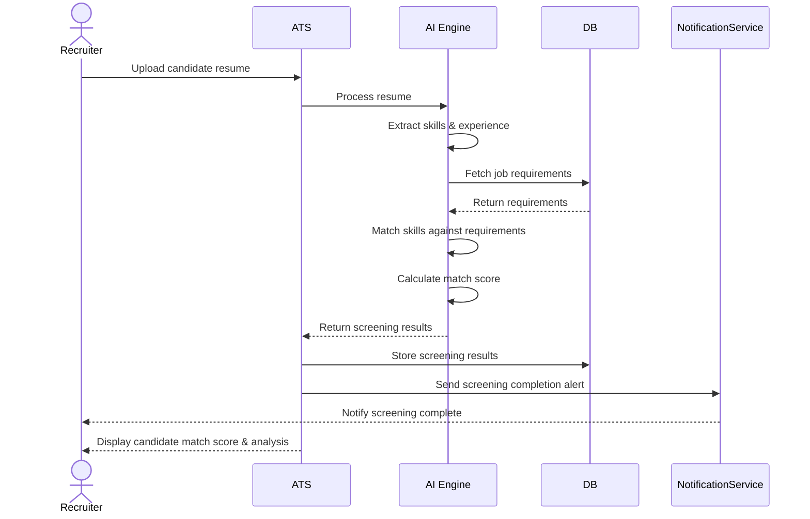
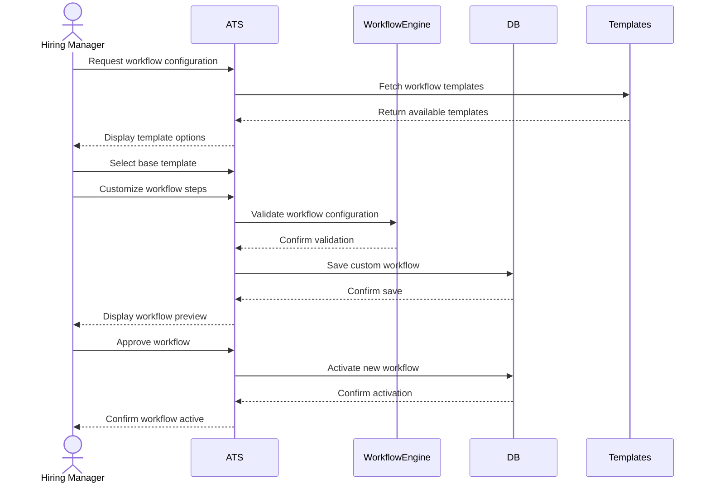
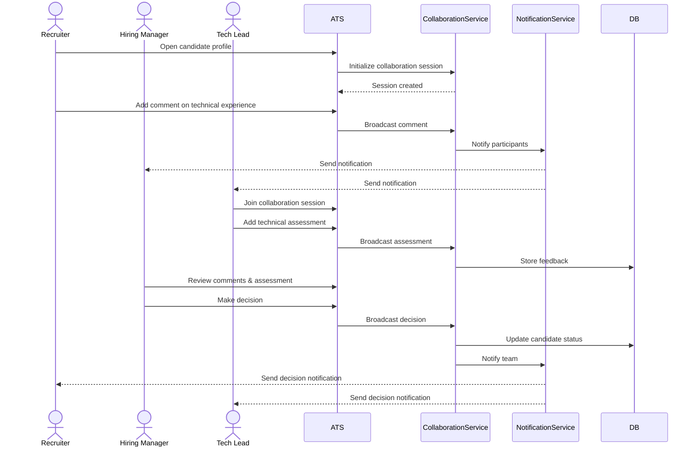
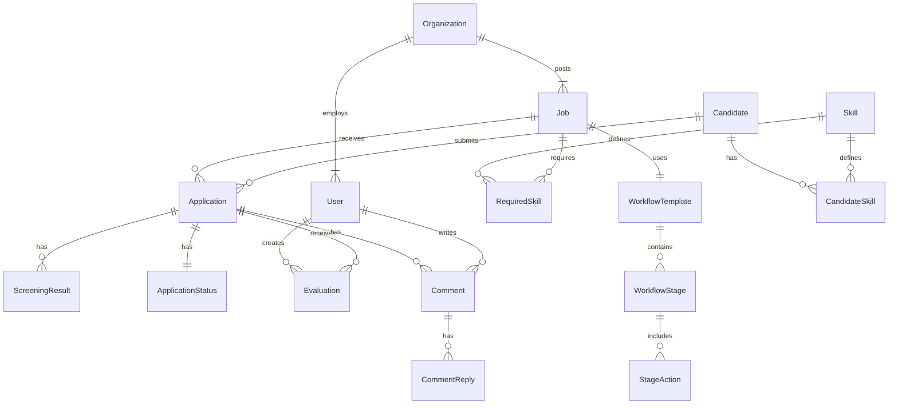
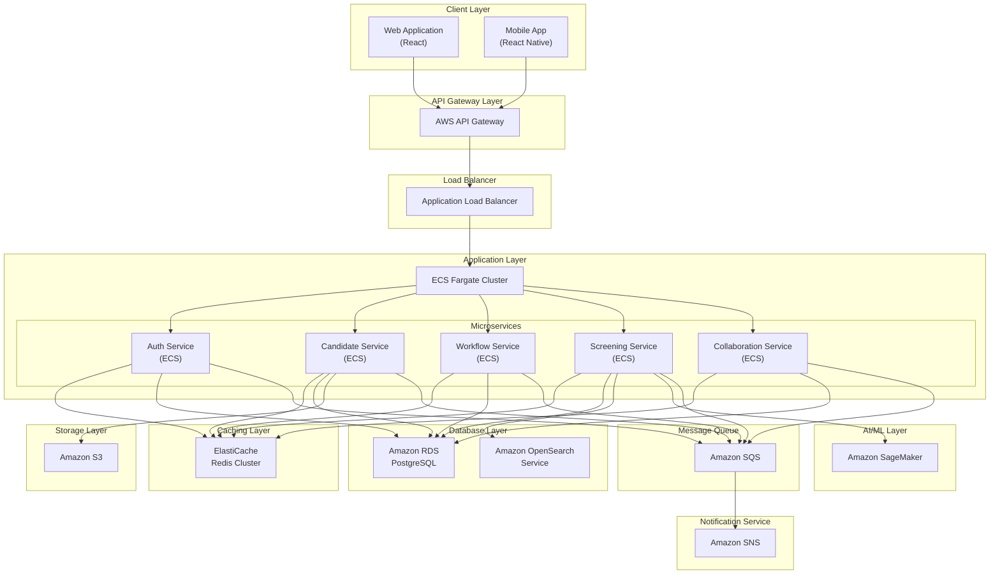
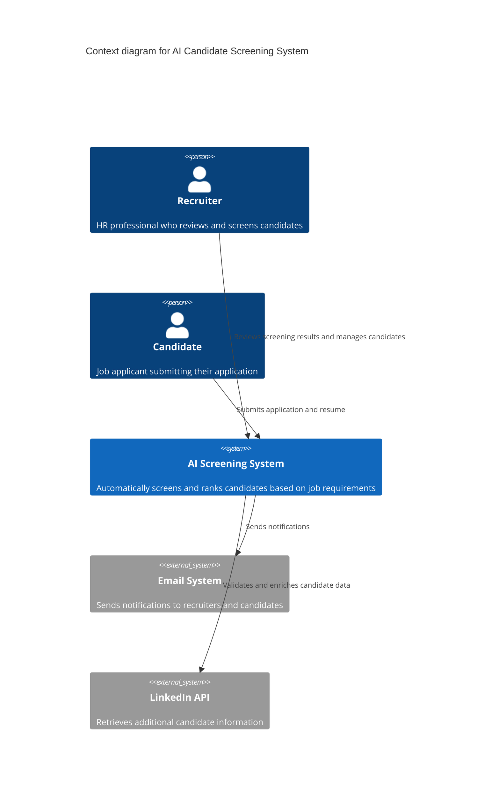
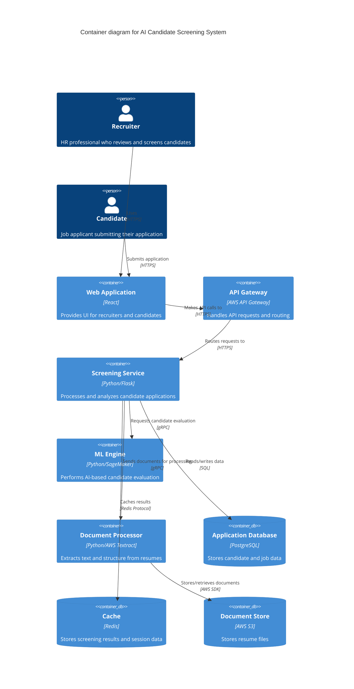
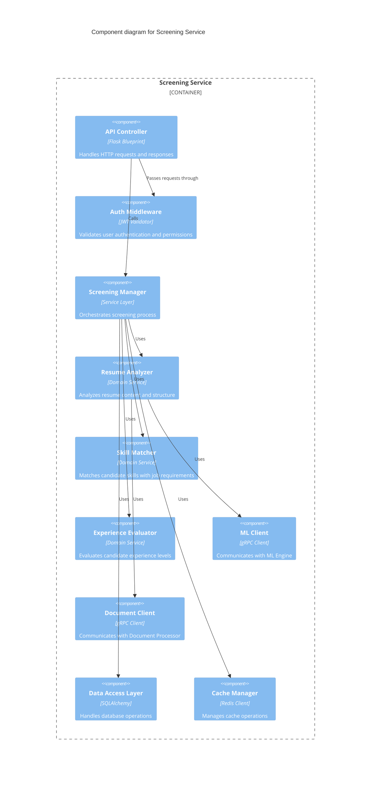

With this additional information, we can develop an ATS focused on the IT hiring market, optimizing the recruitment process for roles that are often highly specialized, competitive, and in-demand. Here’s a structured approach covering the goals you've outlined:

---

### 1. **ATS Description and Competitor Landscape**

**Description:**
This ATS will be an advanced, configurable platform tailored to the unique challenges of recruiting IT professionals. It will offer end-to-end recruitment workflow customization, real-time collaboration tools for recruiters and hiring managers, and powerful AI-driven capabilities. By supporting complex workflows and facilitating seamless coordination, the ATS will enable hiring teams to focus on securing top talent quickly and efficiently.

**Competitors**:
Here’s an overview of leading ATS platforms and areas for potential differentiation:

- **TeamTailor**: Known for its user-friendly interface and branding capabilities. It supports some automation and collaboration but lacks deep, customizable AI for screening IT candidates.
- **Greenhouse**: Widely used for its robust data analytics and interview scheduling features. Greenhouse, however, has limited real-time collaboration and workflow customization options, making it less flexible for niche industries like IT.
- **Lever**: Strong in candidate relationship management (CRM), ideal for building talent pools and engaging passive candidates. Lever’s AI capabilities are somewhat limited, especially for industry-specific skills analysis.
- **SmartRecruiters**: A feature-rich ATS with AI-enabled recommendations and smart automation tools, but it is generally not as customizable in terms of workflows and role-based permissions.
- **Workday Recruiting**: Comprehensive functionality with integrations to other Workday modules (e.g., HR, payroll) and some AI capabilities. Its complex setup, however, can be a challenge for companies needing flexible and easy-to-adjust workflows.

**Differentiation Opportunity**:
To stand out, our ATS could combine robust, configurable workflows with industry-specific AI (e.g., tech stack skill matching) and real-time collaboration, a blend few competitors fully offer.

---

### 2. **Added Value of the ATS**

Our ATS would offer the following added value, specifically aimed at IT-focused recruiting needs:

- **Configurability and Workflow Flexibility**: Unlike traditional ATSs, this solution will allow recruiters and managers to tailor workflows according to specific roles, regions, or team preferences. This flexibility ensures that the ATS can handle the varying recruitment processes that may differ between IT consulting and corporate IT departments.
  
- **Enhanced Candidate Screening**: By leveraging AI-driven candidate screening tools that analyze technical skills, past experiences, and specific certifications, this ATS will help match IT candidates more accurately to roles. This includes support for screening based on skills in coding languages, frameworks, and project experience relevant to the role.

- **Seamless Real-Time Collaboration**: Built-in collaborative features will let recruiters, hiring managers, and stakeholders interact within the ATS, enabling discussions, shared notes, and feedback that streamline decision-making. Push notifications and integrated messaging allow for immediate action, enhancing responsiveness in a competitive hiring market.

- **In-Depth Analytics and Custom Metrics**: Key metrics relevant to IT recruiting, like time-to-hire for specific technical roles, source effectiveness, and diversity metrics, will be tracked and displayed in customizable dashboards. This data will help hiring teams continuously refine their approach.

---

### 3. **Competitive Advantages of Our ATS Proposal**

Our ATS will incorporate distinct features that address both the complexities of the IT recruitment landscape and the need for flexibility, efficiency, and enhanced collaboration:

1. **Industry-Specific AI Assistance**:
   - Our AI module will be trained to understand IT-related qualifications, certifications, and skills, which are often highly specialized and change frequently. This industry-specific AI screening goes beyond general AI filtering to match candidates based on tech stacks, languages, frameworks, or even familiarity with specific methodologies (e.g., Agile, DevOps).
   - It will provide automatic scoring for candidate resumes and suggest suitable candidates to managers in real-time, significantly cutting down the screening phase.

2. **Automation Across the Hiring Pipeline**:
   - We will automate recurring tasks, like candidate follow-ups, interview scheduling, and pipeline updates, allowing recruiters to manage a larger volume of candidates with reduced manual effort.
   - Automation will also extend to sending updates or nudges to candidates based on their engagement level or inactivity, enhancing candidate experience and reducing drop-offs.

3. **Configurable Workflows and Access Permissions**:
   - Unlike many competitors, our ATS will offer highly configurable workflows that can adapt to specific team requirements or organizational policies, ensuring it’s valuable for both consultancy firms and IT departments in corporate environments.
   - Hiring managers will have full pipeline visibility and granular control, enabling them to add comments, rate candidates, and approve or reject applicants seamlessly, which minimizes bottlenecks and improves accountability.

4. **Real-Time Collaboration and Communication**:
   - The system will feature built-in chat, notifications, and comment threads to facilitate active collaboration. For example, a recruiter and hiring manager can discuss a candidate’s progress and adjust the evaluation criteria on the go.
   - Integration with communication tools (e.g., Slack, Microsoft Teams) will provide instant updates to teams, so everyone stays informed without logging into the ATS.

5. **Advanced Reporting and Customizable Metrics Dashboards**:
   - Custom dashboards will give users clear visibility into hiring trends, allowing them to track how the recruitment process performs in areas specific to IT hires (like role-based time-to-hire and technical skill gaps).
   - Predictive analytics can help teams anticipate hiring bottlenecks and adjust proactively. For example, if time-to-fill for a specific skillset increases, the ATS can suggest expanding sourcing channels or tweaking the job description.

---

### Summary

Our ATS will stand out in the market by offering a unique combination of AI-driven IT-specific candidate screening, highly configurable workflows, and advanced real-time collaboration tools. This configuration supports recruiters, hiring managers, and HR leaders alike, boosting productivity, optimizing collaboration, and ensuring a smooth, efficient, and engaging experience for both candidates and hiring teams. 

This solution’s adaptability for various IT recruitment needs, combined with its proactive AI and analytics features, makes it a compelling choice for companies looking to stay competitive in attracting top IT talent.


---

### Main Features of the New ATS (in Order of Relevance)

1. **Industry-Specific AI Candidate Screening**  
   - *Relevance*: High. IT hiring often requires candidates with niche skills, making tailored AI-driven screening highly valuable.
   - *Details*: AI algorithms assess candidates for specific technical skills, certifications, and relevant experiences. This feature will reduce manual screening time, helping teams identify top candidates quickly.

2. **Configurable Recruitment Workflows**  
   - *Relevance*: High. Different organizations and roles require varying recruitment steps, especially in IT.
   - *Details*: Customizable workflows let recruiters design hiring processes tailored to specific roles or departments. This includes flexible steps for screening, interviewing, and decision-making to match each organization’s unique requirements.

3. **Real-Time Collaboration Tools**  
   - *Relevance*: High. Fast feedback loops and collaboration are essential, especially in competitive hiring environments.
   - *Details*: In-app communication features (like chat, comments, and tagging) enable recruiters and hiring managers to collaborate on candidate evaluations and streamline decision-making.

4. **Automated Task Management**  
   - *Relevance*: Medium to High. Automating routine tasks increases productivity by reducing repetitive, time-consuming tasks.
   - *Details*: Automations handle follow-up emails, interview scheduling, and candidate updates. They can also prompt hiring managers for feedback to keep the hiring process on track.

5. **Customizable Analytics and Reporting**  
   - *Relevance*: Medium to High. Data-driven hiring decisions improve the quality and efficiency of the recruitment process.
   - *Details*: Custom dashboards display key metrics like time-to-hire, cost-per-hire, source effectiveness, and diversity metrics. Predictive analytics can provide insights into pipeline bottlenecks and suggest actions.

6. **Integration with Communication and Productivity Tools**  
   - *Relevance*: Medium. Seamless integration with existing tools simplifies the adoption of new software.
   - *Details*: Integrations with platforms like Slack, Microsoft Teams, and email systems allow hiring updates and reminders to flow directly into these tools, helping recruiters and managers stay aligned without switching platforms.

7. **Automated Candidate Engagement**  
   - *Relevance*: Medium. Reduces candidate drop-off and improves their experience, especially in competitive IT job markets.
   - *Details*: AI-powered chatbots and automated messaging keep candidates informed and engaged throughout the process, reducing the chances of losing top talent.

---

### Lean Canvas Diagram for the ATS Business Model

Here’s a Lean Canvas to provide a snapshot of the ATS business model, focusing on core components and target user needs.

| Section               | Description                                                                                                                                                                                                                                                                           |
|-----------------------|---------------------------------------------------------------------------------------------------------------------------------------------------------------------------------------------------------------------------------------------------------------------------------------|
| **Problem**           | - Difficult to screen IT candidates with specialized skills.  <br> - Slow feedback and collaboration between recruiters and hiring managers. <br> - High dropout rates from candidates due to prolonged processes or poor engagement.                                                |
| **Customer Segments** | - HR departments in IT consulting firms, tech companies, banks, insurance, and retail companies hiring tech talent. <br> - Hiring managers and technical leaders responsible for IT recruitment.                                                                                     |
| **Unique Value Proposition** | A customizable ATS for IT recruitment, featuring industry-specific AI screening, automated workflows, and real-time collaboration, enabling faster and more accurate hiring decisions for tech roles.                                                                            |
| **Solution**          | - AI screening tailored to tech roles for rapid identification of qualified candidates. <br> - Configurable workflows to suit varied hiring processes. <br> - Real-time collaboration tools that facilitate continuous feedback from hiring managers.                                  |
| **Channels**          | - Direct sales to large companies with high-volume IT hiring needs. <br> - Partnerships with HR consultancies and tech industry associations. <br> - Online marketing through industry-specific platforms (e.g., LinkedIn, HR tech forums).                                          |
| **Revenue Streams**   | - SaaS subscription model based on company size and monthly active users. <br> - Premium add-ons (e.g., enhanced AI reporting, specialized integrations). <br> - Custom onboarding and training services for enterprise clients.                                                       |
| **Key Metrics**       | - Customer acquisition rate (new clients adopting the ATS). <br> - Time-to-hire reduction for users. <br> - Candidate satisfaction scores (via feedback tools integrated into the candidate journey).                                         |
| **Cost Structure**    | - Development and maintenance of AI algorithms and software infrastructure. <br> - Sales and marketing, particularly focused on B2B channels. <br> - Customer success and support services.                                                   |
| **Unfair Advantage**  | - AI trained specifically for IT job market needs, offering skill-based screening and insights that are more precise than generic ATS tools. <br> - High configurability that accommodates diverse recruitment needs in a rapidly evolving industry.                                |

---

This Lean Canvas highlights a solution that differentiates itself by its technical focus, advanced collaboration, and real-time insights tailored to the needs of IT hiring.

---

I'll help you create detailed use cases and sequence diagrams for the top 3 features mentioned in the document: Industry-Specific AI Candidate Screening, Configurable Recruitment Workflows, and Real-Time Collaboration Tools.


### 1. Industry-Specific AI Candidate Screening

**Use Case Description:**
A recruiter receives a new application for a Senior Full Stack Developer position. The AI system automatically screens the candidate's resume against the job requirements, analyzing technical skills, certifications, and experience.



### 2. Configurable Recruitment Workflows

**Use Case Description:**
A hiring manager needs to create a custom workflow for hiring senior developers that includes additional technical assessment steps and multiple interview rounds.



### 3. Real-Time Collaboration Tools

**Use Case Description:**
Multiple team members are reviewing a candidate's profile and need to discuss their evaluation and make a collective decision about moving forward.



Each of these use cases demonstrates key functionality of the system:

1. **AI Screening** shows how the system automatically processes and evaluates candidates, saving significant time for recruiters while ensuring consistent evaluation of technical skills.

2. **Workflow Configuration** illustrates the system's flexibility in adapting to different hiring needs and organizational requirements, allowing hiring managers to create custom processes.

3. **Real-Time Collaboration** demonstrates how multiple stakeholders can work together efficiently within the system, sharing feedback and making decisions quickly.

---

I'll design a comprehensive data model that supports the AI Screening, Workflow Configuration, and Real-Time Collaboration use cases. I'll create it using a Mermaid entity-relationship diagram and then detail the entities with their attributes and relationships.




# Detailed Data Model Specification

## Core Entities

### Organization
- `organization_id` (PK) UUID
- `name` VARCHAR(255)
- `industry` VARCHAR(100)
- `created_at` TIMESTAMP
- `updated_at` TIMESTAMP

### User
- `user_id` (PK) UUID
- `organization_id` (FK) UUID
- `email` VARCHAR(255)
- `first_name` VARCHAR(100)
- `last_name` VARCHAR(100)
- `role` ENUM ('RECRUITER', 'HIRING_MANAGER', 'TECH_LEAD', 'ADMIN')
- `created_at` TIMESTAMP
- `updated_at` TIMESTAMP

### Candidate
- `candidate_id` (PK) UUID
- `email` VARCHAR(255)
- `first_name` VARCHAR(100)
- `last_name` VARCHAR(100)
- `phone` VARCHAR(50)
- `resume_url` VARCHAR(500)
- `linkedin_url` VARCHAR(255)
- `github_url` VARCHAR(255)
- `created_at` TIMESTAMP
- `updated_at` TIMESTAMP

### Job
- `job_id` (PK) UUID
- `organization_id` (FK) UUID
- `workflow_template_id` (FK) UUID
- `title` VARCHAR(255)
- `description` TEXT
- `status` ENUM ('DRAFT', 'ACTIVE', 'PAUSED', 'CLOSED')
- `created_at` TIMESTAMP
- `updated_at` TIMESTAMP

## Application Processing

### Application
- `application_id` (PK) UUID
- `candidate_id` (FK) UUID
- `job_id` (FK) UUID
- `current_stage_id` (FK) UUID
- `status` ENUM ('NEW', 'SCREENING', 'IN_REVIEW', 'INTERVIEW', 'OFFER', 'REJECTED', 'WITHDRAWN')
- `applied_at` TIMESTAMP
- `created_at` TIMESTAMP
- `updated_at` TIMESTAMP

### ScreeningResult
- `screening_id` (PK) UUID
- `application_id` (FK) UUID
- `overall_score` DECIMAL(5,2)
- `skill_matches` JSONB
- `experience_match` DECIMAL(5,2)
- `screening_notes` TEXT
- `created_at` TIMESTAMP
- `updated_at` TIMESTAMP

### Evaluation
- `evaluation_id` (PK) UUID
- `application_id` (FK) UUID
- `user_id` (FK) UUID
- `stage_id` (FK) UUID
- `score` INTEGER
- `feedback` TEXT
- `decision` ENUM ('ADVANCE', 'REJECT', 'HOLD')
- `created_at` TIMESTAMP
- `updated_at` TIMESTAMP

## Skills Management

### Skill
- `skill_id` (PK) UUID
- `name` VARCHAR(100)
- `category` VARCHAR(100)
- `created_at` TIMESTAMP
- `updated_at` TIMESTAMP

### RequiredSkill
- `required_skill_id` (PK) UUID
- `job_id` (FK) UUID
- `skill_id` (FK) UUID
- `importance_level` ENUM ('REQUIRED', 'PREFERRED', 'NICE_TO_HAVE')
- `years_required` INTEGER
- `created_at` TIMESTAMP
- `updated_at` TIMESTAMP

### CandidateSkill
- `candidate_skill_id` (PK) UUID
- `candidate_id` (FK) UUID
- `skill_id` (FK) UUID
- `years_experience` INTEGER
- `proficiency_level` ENUM ('BEGINNER', 'INTERMEDIATE', 'ADVANCED', 'EXPERT')
- `created_at` TIMESTAMP
- `updated_at` TIMESTAMP

## Workflow Management

### WorkflowTemplate
- `workflow_template_id` (PK) UUID
- `organization_id` (FK) UUID
- `name` VARCHAR(255)
- `description` TEXT
- `is_active` BOOLEAN
- `created_at` TIMESTAMP
- `updated_at` TIMESTAMP

### WorkflowStage
- `stage_id` (PK) UUID
- `workflow_template_id` (FK) UUID
- `name` VARCHAR(255)
- `order_index` INTEGER
- `is_required` BOOLEAN
- `created_at` TIMESTAMP
- `updated_at` TIMESTAMP

### StageAction
- `action_id` (PK) UUID
- `stage_id` (FK) UUID
- `action_type` ENUM ('SCREENING', 'REVIEW', 'INTERVIEW', 'ASSESSMENT', 'DECISION')
- `order_index` INTEGER
- `is_required` BOOLEAN
- `created_at` TIMESTAMP
- `updated_at` TIMESTAMP

## Collaboration

### Comment
- `comment_id` (PK) UUID
- `application_id` (FK) UUID
- `user_id` (FK) UUID
- `content` TEXT
- `visibility` ENUM ('PUBLIC', 'INTERNAL', 'PRIVATE')
- `created_at` TIMESTAMP
- `updated_at` TIMESTAMP

### CommentReply
- `reply_id` (PK) UUID
- `comment_id` (FK) UUID
- `user_id` (FK) UUID
- `content` TEXT
- `created_at` TIMESTAMP
- `updated_at` TIMESTAMP

## Key Relationships

1. **AI Screening Support:**
   - Application -> ScreeningResult (1:N)
   - Job -> RequiredSkill (1:N)
   - Candidate -> CandidateSkill (1:N)
   - Skill -> RequiredSkill (1:N)
   - Skill -> CandidateSkill (1:N)

2. **Workflow Configuration Support:**
   - Organization -> WorkflowTemplate (1:N)
   - WorkflowTemplate -> WorkflowStage (1:N)
   - WorkflowStage -> StageAction (1:N)
   - Job -> WorkflowTemplate (N:1)
   - Application -> WorkflowStage (N:1)

3. **Real-Time Collaboration Support:**
   - User -> Comment (1:N)
   - Application -> Comment (1:N)
   - Comment -> CommentReply (1:N)
   - User -> Evaluation (1:N)
   - Application -> Evaluation (1:N)


This data model supports the three main use cases in the following ways:

1. **AI Candidate Screening**
- Stores candidate skills and experience (CandidateSkill)
- Maintains job requirements (RequiredSkill)
- Records screening results and matches (ScreeningResult)
- Tracks the overall application status (Application)

2. **Configurable Recruitment Workflows**
- Defines workflow templates (WorkflowTemplate)
- Configures stages and actions (WorkflowStage, StageAction)
- Links workflows to jobs (Job)
- Tracks application progress through stages (Application)

3. **Real-Time Collaboration**
- Manages user roles and permissions (User)
- Supports comments and replies (Comment, CommentReply)
- Records evaluations and feedback (Evaluation)
- Tracks application status changes (Application)

The model includes audit fields (created_at, updated_at) for all entities and uses UUIDs as primary keys to support distributed systems. It also implements soft deletion where necessary (is_active fields) and uses appropriate data types and constraints for each field.

---

I'll create a high-level system design using AWS services, breaking down the main components and their interactions. I'll include both a system architecture diagram and a detailed explanation of each component.




# High-Level System Design Specification

## 1. Client Layer
- **Web Application**
  - React-based SPA hosted on Amazon S3 + CloudFront
  - Implements real-time updates using WebSocket connections
  - Responsive design for desktop and tablet users

- **Mobile Application**
  - React Native app for iOS and Android
  - Push notification support using AWS SNS
  - Offline capabilities for basic features

## 2. API Gateway Layer
- **AWS API Gateway**
  - RESTful API endpoints for all services
  - WebSocket API for real-time features
  - API key management and throttling
  - Request validation and transformation
  - OAuth2/JWT token validation

## 3. Application Layer (Microservices)

### Authentication Service
- **Technology**: Node.js on ECS Fargate
- **Responsibilities**:
  - User authentication and authorization
  - JWT token management
  - Role-based access control
  - Integration with corporate SSO

### Candidate Service
- **Technology**: Java/Spring Boot on ECS Fargate
- **Responsibilities**:
  - Candidate profile management
  - Application processing
  - Resume parsing and storage
  - Skills management

### Workflow Service
- **Technology**: Python/FastAPI on ECS Fargate
- **Responsibilities**:
  - Workflow template management
  - Stage and action configuration
  - Application status tracking
  - Workflow validation

### Screening Service
- **Technology**: Python/Flask on ECS Fargate
- **Responsibilities**:
  - AI-based resume screening
  - Skills matching
  - Experience evaluation
  - Integration with SageMaker models

### Collaboration Service
- **Technology**: Node.js on ECS Fargate
- **Responsibilities**:
  - Real-time commenting system
  - Evaluation management
  - Notification dispatch
  - Activity tracking

## 4. Data Layer

### Primary Database
- **Amazon RDS (PostgreSQL)**
  - Multi-AZ deployment for high availability
  - Read replicas for read-heavy operations
  - Automated backups and point-in-time recovery

### Search Engine
- **Amazon OpenSearch Service**
  - Candidate and job search
  - Full-text resume search
  - Analytics and reporting

### Caching Layer
- **Amazon ElastiCache (Redis)**
  - Session management
  - API response caching
  - Real-time collaboration data
  - Temporary data storage

## 5. AI/ML Layer
- **Amazon SageMaker**
  - Custom models for candidate screening
  - Skills matching algorithms
  - Experience evaluation models
  - Continuous model training and improvement

## 6. Storage Layer
- **Amazon S3**
  - Resume storage
  - Document attachments
  - Application assets
  - System backups

## 7. Message Queue & Notification
- **Amazon SQS**
  - Asynchronous task processing
  - Service decoupling
  - Load leveling

- **Amazon SNS**
  - Push notifications
  - Email notifications
  - SMS notifications
  - WebSocket event broadcasting

## 8. DevOps & Monitoring

### Infrastructure as Code
- **AWS CDK/CloudFormation**
  - Infrastructure provisioning
  - Environment consistency
  - Version control for infrastructure

### Monitoring & Logging
- **AWS CloudWatch**
  - Application and infrastructure monitoring
  - Log aggregation
  - Custom metrics and dashboards
  - Alerts and notifications

### CI/CD Pipeline
- **AWS CodePipeline**
  - Automated testing
  - Deployment automation
  - Blue-green deployments
  - Rollback capabilities

## Security Features

### Network Security
- VPC with private and public subnets
- Network ACLs and Security Groups
- AWS WAF for web application firewall
- AWS Shield for DDoS protection

### Data Security
- Encryption at rest using AWS KMS
- SSL/TLS encryption in transit
- Secrets management using AWS Secrets Manager
- Regular security audits and compliance checks

## Scalability & Performance

### Auto Scaling
- ECS service auto-scaling
- RDS read replica auto-scaling
- ElastiCache cluster auto-scaling

### Performance Optimization
- CloudFront CDN for static content
- ElastiCache for frequent data access
- Read replicas for database read operations
- SQS for handling peak loads


This high-level system design provides:

1. **Scalability**: The microservices architecture on ECS Fargate allows independent scaling of components based on demand.

2. **High Availability**: Multi-AZ deployments, load balancing, and auto-scaling ensure system reliability.

3. **Real-time Capabilities**: WebSocket connections through API Gateway and ElastiCache support real-time collaboration features.

4. **AI Integration**: SageMaker integration enables sophisticated candidate screening and matching.

5. **Security**: Comprehensive security measures at network, application, and data levels.

Key features for our three main use cases:

1. **AI Candidate Screening**
- Screening Service processes resumes using SageMaker models
- OpenSearch enables efficient candidate searching
- S3 stores resume documents
- SQS/SNS handle async processing and notifications

2. **Configurable Workflow**
- Workflow Service manages templates and configurations
- RDS stores workflow definitions
- Redis caches active workflows
- SQS ensures reliable state transitions

3. **Real-time Collaboration**
- Collaboration Service manages real-time interactions
- WebSocket API enables instant updates
- Redis handles real-time data
- SNS delivers notifications

---

I'll create a detailed C4 model for the AI Candidate Screening component, showing the Context, Container, Component, and Code levels where appropriate.







```python
# Domain Models

class Candidate:
    def __init__(self, id: UUID, name: str, email: str):
        self.id = id
        self.name = name
        self.email = email
        self.skills: List[Skill] = []
        self.experience: List[Experience] = []
        self.education: List[Education] = []

class ScreeningResult:
    def __init__(self, candidate_id: UUID, job_id: UUID):
        self.id = UUID()
        self.candidate_id = candidate_id
        self.job_id = job_id
        self.overall_score: float = 0.0
        self.skill_matches: Dict[str, float] = {}
        self.experience_score: float = 0.0
        self.education_score: float = 0.0
        self.created_at: datetime = datetime.now()

# Service Layer

class ScreeningManager:
    def __init__(
        self,
        resume_analyzer: ResumeAnalyzer,
        skill_matcher: SkillMatcher,
        exp_evaluator: ExperienceEvaluator,
        repository: ScreeningRepository,
        cache: CacheManager
    ):
        self.resume_analyzer = resume_analyzer
        self.skill_matcher = skill_matcher
        self.exp_evaluator = exp_evaluator
        self.repository = repository
        self.cache = cache

    async def screen_candidate(
        self, 
        candidate_id: UUID, 
        job_id: UUID, 
        resume_url: str
    ) -> ScreeningResult:
        # Get candidate and job details
        candidate = await self.repository.get_candidate(candidate_id)
        job = await self.repository.get_job(job_id)

        # Check cache first
        cached_result = await self.cache.get_screening_result(candidate_id, job_id)
        if cached_result:
            return cached_result

        # Analyze resume
        resume_data = await self.resume_analyzer.analyze(resume_url)
        
        # Match skills
        skill_scores = await self.skill_matcher.match_skills(
            resume_data.skills,
            job.required_skills
        )
        
        # Evaluate experience
        exp_score = await self.exp_evaluator.evaluate(
            resume_data.experience,
            job.requirements
        )
        
        # Create screening result
        result = ScreeningResult(candidate_id, job_id)
        result.skill_matches = skill_scores
        result.experience_score = exp_score
        result.overall_score = self._calculate_overall_score(
            skill_scores,
            exp_score
        )
        
        # Save and cache result
        await self.repository.save_screening_result(result)
        await self.cache.set_screening_result(result)
        
        return result

    def _calculate_overall_score(
        self,
        skill_scores: Dict[str, float],
        exp_score: float
    ) -> float:
        skill_avg = sum(skill_scores.values()) / len(skill_scores)
        return (skill_avg * 0.7) + (exp_score * 0.3)

# Infrastructure Layer

class ScreeningRepository:
    def __init__(self, db_session: Session):
        self.db = db_session

    async def get_candidate(self, candidate_id: UUID) -> Candidate:
        return await self.db.query(Candidate)\
            .filter(Candidate.id == candidate_id)\
            .first()

    async def save_screening_result(self, result: ScreeningResult) -> None:
        self.db.add(result)
        await self.db.commit()

class CacheManager:
    def __init__(self, redis_client: Redis):
        self.redis = redis_client

    async def get_screening_result(
        self,
        candidate_id: UUID,
        job_id: UUID
    ) -> Optional[ScreeningResult]:
        key = f"screening:{candidate_id}:{job_id}"
        data = await self.redis.get(key)
        return ScreeningResult.from_json(data) if data else None

    async def set_screening_result(self, result: ScreeningResult) -> None:
        key = f"screening:{result.candidate_id}:{result.job_id}"
        await self.redis.setex(
            key,
            timedelta(hours=24),
            result.to_json()
        )

```

This C4 model breakdown shows the AI Candidate Screening system at different levels of abstraction:

1. **Context Level**:
- Shows the system's interactions with external actors (recruiters and candidates)
- Identifies external system dependencies (email and LinkedIn)
- Defines the system's main responsibilities

2. **Container Level**:
- Breaks down the system into its major technical components
- Shows the primary technologies used
- Defines the main data stores and their purposes
- Illustrates the flow of data between containers

3. **Component Level**:
- Details the internal structure of the Screening Service
- Shows the separation of concerns between components
- Illustrates the communication patterns between components
- Defines clear boundaries and responsibilities

4. **Code Level**:
- Shows the key classes and their relationships
- Implements Domain-Driven Design patterns
- Demonstrates clean architecture principles
- Includes error handling and caching strategies

Key features highlighted in the model:

1. **Separation of Concerns**:
- Clear boundaries between presentation, business logic, and data access
- Independent services for different aspects of screening
- Modular components that can be developed and scaled independently

2. **Scalability Considerations**:
- Caching layer for performance optimization
- Asynchronous processing for long-running tasks
- Microservices architecture for independent scaling

3. **Security**:
- Authentication middleware
- Secure API Gateway
- Encrypted data storage

4. **Performance**:
- Redis caching for screening results
- Efficient database access patterns
- Optimized document processing pipeline


