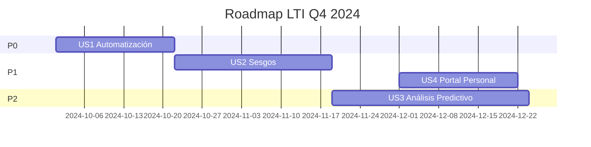
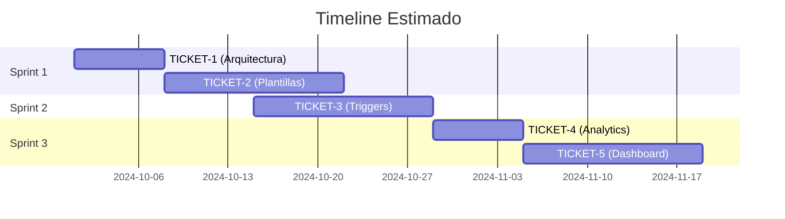

PVA
Eres un experto Product Manager y Business Analyst con varios años de experiencia y buenas practicas. 
Necesitamos crear una app cuya descripción es:
* **LTI** es una solución avanzada de gestión de candidatos que utiliza la inteligencia artificial, la automatización personalizada y el análisis predictivo para redefinir el proceso de selección y contratación. Pensada para empresas modernas que valoran la eficiencia y la experiencia del candidato, LTI se diferencia de otros ATS al ofrecer un enfoque centrado en la transparencia, la inclusión y la personalización completa. Entre sus funcionalidades diferenciadoras están: la predicción de éxito del candidato, la identificación de sesgos en tiempo real, un sistema de onboarding altamente personalizable y un portal de marca personal para candidatos. LTI busca no solo optimizar el proceso de contratación, sino también mejorar la retención y la experiencia del talento, apoyando a los equipos de recursos humanos con recomendaciones proactivas y herramientas de análisis en tiempo real.
Las funciones principales de LTI son:
* **Automatización de Flujos de Trabajo y Comunicación**
   * Personalización de tareas automáticas, desde el envío de correos y recordatorios hasta la programación de entrevistas. La app automatiza el contacto con los candidatos en cada etapa del proceso.
* **Análisis Predictivo con IA**
      * Herramientas que predicen el éxito del candidato en el puesto y la retención potencial, basadas en la experiencia y competencias. LTI brinda recomendaciones basadas en IA para mejorar las estrategias de selección.
* **Gestión de Diversidad e Inclusión**
      * Análisis en tiempo real para identificar sesgos en las etapas de selección, optimizando los procesos para promover la inclusión. Permite la recopilación de feedback anónimo de los candidatos sobre el proceso.
* **Portal de Empleo Personalizado para el Candidato**
      * Cada candidato puede construir su perfil de “marca personal” en la plataforma, mostrando sus logros y habilidades de manera destacada. Permite la conexión con empleados de la empresa para conocer mejor la cultura antes de aceptar una oferta.
* **Onboarding y Gestión del Ciclo de Vida del Empleado**
      * Automatización de procesos previos a la incorporación, como la recopilación de documentos y presentación del equipo. Permite la integración completa con RR.HH. para realizar un seguimiento post-contratación en los primeros meses, apoyando la retención.
* **Métricas y Analítica en Tiempo Real**
      * Un panel de control muestra estadísticas y métricas de reclutamiento, incluyendo diversidad y conversión de candidatos. Incluye análisis de datos para mejorar continuamente los procesos de selección y contratación.
En base a esta información, necesito que me generes 4 User Stories basadas en las necesidades del usuario y los requisitos del producto. Utiliza buenas prácticas.

Claude 3.5 Sonnet
Te ayudaré a crear User Stories siguiendo el formato estándar "Como [rol] quiero [funcionalidad] para [beneficio]", enfocándonos en las necesidades más críticas del usuario y asegurándonos que sean INVEST (Independent, Negotiable, Valuable, Estimable, Small, Testable).

1. **Automatización de Comunicación con Candidatos**
```
Como reclutador
Quiero configurar flujos automáticos de comunicación por etapa del proceso
Para mantener a los candidatos informados sin intervención manual y reducir el tiempo de gestión en un 60%

Criterios de Aceptación:
- Poder crear plantillas de correo personalizables por etapa del proceso
- Configurar triggers automáticos basados en cambios de estado del candidato
- Incluir variables dinámicas en las plantillas (nombre, puesto, fecha, etc.)
- Permitir vista previa antes de activar el flujo
- Seguimiento de tasa de apertura y respuesta de correos
```

2. **Análisis Predictivo de Candidatos**
```
Como gerente de contratación
Quiero recibir un score predictivo de éxito para cada candidato
Para tomar decisiones más objetivas y mejorar la calidad de contratación

Criterios de Aceptación:
- Mostrar puntuación de 0-100 basada en match de habilidades y experiencia
- Desglosar los factores que influyen en el score
- Permitir ajustar los pesos de los criterios de evaluación
- Comparar scores entre candidatos para una misma posición
- Generar reporte de predicción de retención a 12 meses
```

3. **Detección de Sesgos en Tiempo Real**
```
Como responsable de D&I (Diversidad e Inclusión)
Quiero detectar sesgos potenciales durante el proceso de selección
Para garantizar un proceso justo y aumentar la diversidad en la contratación

Criterios de Aceptación:
- Análisis automático de lenguaje en descripciones de puesto
- Alertas de sesgos en cada etapa del proceso
- Dashboard de métricas de diversidad por departamento y nivel
- Recomendaciones específicas para mitigar sesgos detectados
- Opción de anonimizar datos sensibles en screening inicial
```

4. **Portal de Marca Personal del Candidato**
```
Como candidato
Quiero tener un perfil personalizable que destaque mis logros y habilidades
Para diferenciarme y conectar mejor con la cultura de la empresa

Criterios de Aceptación:
- Sección para destacar proyectos y logros con multimedia
- Integración con LinkedIn para importar experiencia
- Espacio para mostrar certificaciones y validaciones
- Sistema de matching con empleados actuales por intereses
- Análisis de compatibilidad cultural con la empresa
```

Estas user stories siguen las mejores prácticas al:
- Ser independientes entre sí
- Tener un valor claro para el usuario final
- Ser lo suficientemente pequeñas para ser completadas en un sprint
- Incluir criterios de aceptación medibles
- Estar centradas en el resultado más que en la implementación
- Permitir negociación y refinamiento

¿Te gustaría que profundicemos en alguna de estas user stories o que generemos algunas adicionales para otras funcionalidades del sistema?

PVA
Ahora necesito que armes un Backlog de producto con esas User Stories, priorizándolas como consideres conveniente acorde a alguna metodología concreta. Hazlo lo más claro posible.

Claude 3.5 Sonnet
Voy a crear un Product Backlog utilizando el método MoSCoW (Must have, Should have, Could have, Won't have) combinado con el framework RICE (Reach, Impact, Confidence, Effort) para la priorización. Esto nos permitirá tener una visión clara de qué desarrollar primero basándonos en valor de negocio e impacto.

# Product Backlog - LTI Recruitment Platform
## Metodología de Priorización
- **RICE Score** = (Reach * Impact * Confidence) / Effort
  - Reach: Número estimado de usuarios impactados por trimestre
  - Impact: Escala 0.25 (bajo) a 3 (masivo)
  - Confidence: Porcentaje de certeza (100% = 1.0)
  - Effort: Estimado en semanas de un equipo

### Must Have (P0) - Sprint 1-2
#### US1: Automatización de Comunicación con Candidatos
- **RICE Score: 84**
  - Reach: 1000 (candidatos/trimestre)
  - Impact: 2.0 (alto)
  - Confidence: 0.8
  - Effort: 3 semanas
- **Justificación**: Funcionalidad core que reduce dramáticamente el tiempo de gestión y mejora la experiencia del candidato
- **Dependencias**: Ninguna
- **Riesgos**: Integración con servicios de email
- **Story Points**: 13

### Should Have (P1) - Sprint 3-4
#### US2: Detección de Sesgos en Tiempo Real
- **RICE Score: 48**
  - Reach: 400 (reclutadores + managers)
  - Impact: 3.0 (masivo)
  - Confidence: 0.8
  - Effort: 4 semanas
- **Justificación**: Crítico para el diferenciador de marca y cumplimiento D&I
- **Dependencias**: US1
- **Riesgos**: Precisión del modelo de IA
- **Story Points**: 20

### Could Have (P2) - Sprint 4-5
#### US3: Análisis Predictivo de Candidatos
- **RICE Score: 36**
  - Reach: 300 (hiring managers)
  - Impact: 2.0 (alto)
  - Confidence: 0.6
  - Effort: 5 semanas
- **Justificación**: Valor agregado significativo pero requiere datos históricos
- **Dependencias**: US1, Base de datos de candidatos
- **Riesgos**: Precisión inicial del modelo
- **Story Points**: 21

### Should Have (P1) - Sprint 6
#### US4: Portal de Marca Personal del Candidato
- **RICE Score: 40**
  - Reach: 800 (candidatos)
  - Impact: 1.0 (medio)
  - Confidence: 0.7
  - Effort: 3 semanas
- **Justificación**: Diferenciador clave pero no bloqueante
- **Dependencias**: US1
- **Riesgos**: Adopción por parte de candidatos
- **Story Points**: 13

## Roadmap Tentativo Q4 2024



## Métricas de Éxito
1. **US1**: 
   - Reducción del 60% en tiempo de gestión de comunicaciones
   - NPS de candidatos > 8/10

2. **US2**:
   - Incremento del 25% en diversidad de contrataciones
   - 95% de procesos sin sesgos detectados

3. **US3**:
   - Predicciones exitosas > 80% precisión
   - Reducción del 30% en rotación temprana

4. **US4**:
   - Tasa de adopción > 70% de candidatos
   - Incremento del 40% en engagement

## Próximos Pasos
1. Validación del backlog con stakeholders
2. Refinamiento de US1 con equipo técnico
3. Definición de arquitectura base
4. Setup del entorno de desarrollo


He estructurado el backlog considerando:

1. **Priorización basada en valor**: La automatización de comunicaciones (US1) es la base necesaria para el resto de funcionalidades y ofrece el ROI más inmediato.

2. **Dependencias técnicas**: Las historias están ordenadas considerando las dependencias técnicas y de datos necesarias.

3. **Complejidad vs Valor**: El análisis predictivo, aunque valioso, está en P2 debido a su complejidad y dependencia de datos históricos.

4. **Quick Wins**: La automatización de comunicaciones ofrece beneficios inmediatos con esfuerzo moderado.

5. **Riesgos**: Cada historia incluye sus riesgos principales para mejor planificación.

¿Te gustaría que profundicemos en algún aspecto específico del backlog o que ajustemos alguna de las priorizaciones?

PVA
Necesito que elijas la "user story" que más valor puede aportar a la app y que generes los Tickets de trabajo necesarios para esa "user story". Aterrízalos técnicamente, tal y como se hace en las reuniones de planificación.


Claude 3.5 Sonnet
Basándome en el análisis previo, la US1 "Automatización de Comunicación con Candidatos" es la que más valor aporta inicialmente porque:
1. Tiene el RICE score más alto (84)
2. Es la base para otras funcionalidades
3. Impacta directamente en la eficiencia operativa y experiencia del candidato
4. Tiene el mejor balance esfuerzo/impacto

Voy a desglosar esta US en tickets técnicos de trabajo:


# US1: Automatización de Comunicación con Candidatos
## Epic Overview
Implementar un sistema de automatización de comunicaciones que permita a los reclutadores configurar y gestionar flujos automáticos de comunicación con candidatos en cada etapa del proceso.

## Tickets Técnicos

### 🎯 TICKET-1: Arquitectura del Sistema de Plantillas
**Tipo**: Technical Task  
**Estimación**: 3 SP  
**Asignado a**: Tech Lead / Arquitecto

**Descripción Técnica**:
- Diseñar la arquitectura del sistema de plantillas
- Definir el modelo de datos para almacenar plantillas y sus versiones
- Especificar la estructura JSON para las variables dinámicas
- Diseñar el sistema de versionado de plantillas

**Criterios de Aceptación**:
- Diagrama de arquitectura aprobado
- Esquema de base de datos documentado
- API contracts definidos
- Plan de escalabilidad documentado

**Dependencias**: Ninguna

---

### 🎯 TICKET-2: Sistema de Gestión de Plantillas
**Tipo**: Feature  
**Estimación**: 5 SP  
**Asignado a**: Frontend Developer

**Descripción Técnica**:
```typescript
interface EmailTemplate {
  id: string;
  name: string;
  subject: string;
  content: string;
  variables: Variable[];
  stage: RecruitmentStage;
  version: number;
  status: 'draft' | 'active';
}

interface Variable {
  key: string;
  type: 'candidate' | 'job' | 'company' | 'custom';
  defaultValue?: string;
}
```

**Tareas**:
- Implementar editor WYSIWYG para plantillas
- Crear sistema de gestión de variables dinámicas
- Desarrollar preview en tiempo real
- Implementar sistema de versionado UI
- Añadir validaciones de contenido

**Tests Requeridos**:
- Unit tests para el editor
- E2E tests para el flujo completo de creación
- Validación de variables dinámicas
- Test de preview

---

### 🎯 TICKET-3: Motor de Automatización de Triggers
**Tipo**: Feature  
**Estimación**: 8 SP  
**Asignado a**: Backend Developer

**Descripción Técnica**:
```typescript
interface Trigger {
  id: string;
  event: RecruitmentEvent;
  conditions: Condition[];
  actions: Action[];
  status: 'active' | 'paused';
  priority: number;
}

interface Action {
  type: 'send_email' | 'send_notification' | 'update_status';
  templateId?: string;
  delay?: number; // in minutes
  retryPolicy?: RetryPolicy;
}
```

**Tareas**:
- Implementar sistema de eventos
- Crear motor de reglas para triggers
- Desarrollar sistema de cola de mensajes
- Implementar manejo de fallos y reintentos
- Añadir logging y monitoreo

**Tests Requeridos**:
- Unit tests para el motor de reglas
- Integration tests con el sistema de emails
- Performance tests para la cola de mensajes
- Pruebas de concurrencia

---

### 🎯 TICKET-4: API de Analytics y Reportes
**Tipo**: Feature  
**Estimación**: 5 SP  
**Asignado a**: Backend Developer

**Descripción Técnica**:
```typescript
interface EmailMetrics {
  templateId: string;
  sent: number;
  delivered: number;
  opened: number;
  clicked: number;
  bounced: number;
  timestamp: Date;
}

interface AnalyticsResponse {
  metrics: EmailMetrics[];
  aggregations: {
    deliveryRate: number;
    openRate: number;
    clickRate: number;
  }
}
```

**Tareas**:
- Implementar endpoints de métricas
- Crear sistema de agregación de datos
- Desarrollar exportación de reportes
- Implementar caching de métricas
- Añadir filtros y segmentación

**Tests Requeridos**:
- Unit tests para cálculos
- Performance tests para queries
- Validación de agregaciones
- Test de concurrencia en cache

---

### 🎯 TICKET-5: Dashboard de Métricas
**Tipo**: Feature  
**Estimación**: 5 SP  
**Asignado a**: Frontend Developer

**Descripción Técnica**:
- Implementar visualizaciones con Recharts
- Crear filtros de fecha y segmentación
- Desarrollar exportación a Excel/CSV
- Implementar actualizaciones en tiempo real
- Añadir drill-down de métricas

**Tests Requeridos**:
- Unit tests para componentes
- E2E tests para exportación
- Tests de responsividad
- Pruebas de rendimiento con grandes datasets

## Estimación Total: 26 Story Points

## Riesgos Técnicos Identificados:
1. Escalabilidad del sistema de colas con alto volumen
2. Latencia en la entrega de emails
3. Consistencia de datos en actualizaciones concurrentes
4. Performance del dashboard con grandes volúmenes

## Plan de Mitigación:
1. Implementar caching en varios niveles
2. Usar sistema de colas distribuido (Redis/RabbitMQ)
3. Implementar circuit breakers
4. Monitoreo proactivo con alertas

## Definition of Done:
- ✅ Código revisado y aprobado
- ✅ Tests automatizados pasando (>90% cobertura)
- ✅ Documentación técnica actualizada
- ✅ Monitoreo implementado
- ✅ Performance tests aprobados


Algunos aspectos clave de esta descomposición:

1. **Arquitectura First**: Comenzamos con un ticket de arquitectura para establecer bases sólidas

2. **Independencia**: Los tickets están diseñados para poder trabajarse en paralelo cuando sea posible

3. **Testing**: Cada ticket incluye requisitos específicos de testing

4. **Monitoreo**: Se incluye observabilidad desde el diseño

5. **Escalabilidad**: Se consideran aspectos de performance y escalabilidad en cada componente

¿Te gustaría que profundicemos en algún ticket específico o que ajustemos algún aspecto de la implementación técnica?

PVA
Ahora necesito que estimes el esfuerzo de los tickets de trabajo usando la metodología que consideres más útil (fibonacci, poker, tallas de camiseta) y las unidades de estimación que consideres más oportunas (horas, puntos de historia).

Claude 3.5 Sonnet
Utilizaré Planning Poker con la secuencia de Fibonacci modificada (1, 2, 3, 5, 8, 13, 20, 40) para los Story Points, ya que:
1. Es ideal para capturar la incertidumbre inherente al desarrollo de software
2. Los números más grandes reflejan mayor incertidumbre
3. Es el estándar de la industria y facilita la velocidad del equipo

Además, incluiré una estimación en tallas de camiseta (XS, S, M, L, XL) para dar contexto adicional a los stakeholders no técnicos.


# Estimación de Esfuerzo - US1: Automatización de Comunicación

## 📊 Resumen de Estimaciones
| Ticket | Story Points | T-Shirt | Confianza | Complejidad Técnica | Riesgo |
|--------|--------------|---------|------------|---------------------|--------|
| TICKET-1 | 5 SP | M | Alta | Alta | Medio |
| TICKET-2 | 8 SP | L | Media | Media | Bajo |
| TICKET-3 | 13 SP | XL | Media | Alta | Alto |
| TICKET-4 | 5 SP | M | Alta | Media | Bajo |
| TICKET-5 | 8 SP | L | Alta | Media | Medio |
| **TOTAL** | **39 SP** | **L** | **Media** | **Alta** | **Medio** |

## 🎯 Desglose Detallado

### TICKET-1: Arquitectura del Sistema de Plantillas
- **Story Points**: 5
- **T-Shirt Size**: M
- **Justificación**: 
  - Complejidad técnica alta pero alcance bien definido
  - Requiere decisiones arquitectónicas importantes
  - Experiencia previa en sistemas similares
- **Consideraciones**:
  - Reuniones de arquitectura necesarias
  - Documentación exhaustiva requerida
  - Revisiones con tech leads

### TICKET-2: Sistema de Gestión de Plantillas
- **Story Points**: 8
- **T-Shirt Size**: L
- **Justificación**:
  - UI compleja con editor WYSIWYG
  - Múltiples componentes interactivos
  - Testing extensivo requerido
- **Consideraciones**:
  - Experiencia de usuario crítica
  - Compatibilidad cross-browser
  - Accesibilidad requerida

### TICKET-3: Motor de Automatización de Triggers
- **Story Points**: 13
- **T-Shirt Size**: XL
- **Justificación**:
  - Sistema complejo de eventos
  - Manejo de concurrencia
  - Alta criticidad del sistema
- **Consideraciones**:
  - Pruebas de carga necesarias
  - Sistema de fallback requerido
  - Monitoreo exhaustivo

### TICKET-4: API de Analytics y Reportes
- **Story Points**: 5
- **T-Shirt Size**: M
- **Justificación**:
  - Alcance bien definido
  - Patrones conocidos
  - Complejidad media
- **Consideraciones**:
  - Optimización de queries
  - Caché de datos
  - Formato de exportación

### TICKET-5: Dashboard de Métricas
- **Story Points**: 8
- **T-Shirt Size**: L
- **Justificación**:
  - UI compleja con gráficos
  - Múltiples filtros y vistas
  - Datos en tiempo real
- **Consideraciones**:
  - Performance con grandes datasets
  - Responsividad
  - UX para filtros complejos

## 📅 Timeline Estimado
Asumiendo un equipo de 4 desarrolladores con una velocidad promedio de 20 SP por sprint de 2 semanas:



## 🎯 Factores de Estimación Considerados

1. **Complejidad Técnica**
   - Arquitectura del sistema
   - Integración entre componentes
   - Requisitos de performance

2. **Riesgos**
   - Dependencias externas
   - Áreas de incertidumbre
   - Necesidad de investigación

3. **Esfuerzo de Testing**
   - Cobertura requerida
   - Tipos de pruebas necesarias
   - Automatización

4. **Experiencia del Equipo**
   - Conocimiento del dominio
   - Familiaridad con tecnologías
   - Proyectos similares previos

## 📈 Velocidad Esperada
- Sprint 1: 13 SP
- Sprint 2: 13 SP
- Sprint 3: 13 SP

## 🎯 Confidence Level
- Alta (>80%): TICKET-1, TICKET-4, TICKET-5
- Media (60-80%): TICKET-2, TICKET-3

## 🔄 Recomendaciones
1. Comenzar con TICKET-1 para establecer bases sólidas
2. Paralelizar TICKET-2 y TICKET-4 si hay recursos disponibles
3. TICKET-3 requiere atención especial por su complejidad
4. Revisar estimaciones después del primer sprint


Consideraciones adicionales sobre la estimación:

1. **Granularidad**: Los tickets más grandes (13 SP) podrían necesitar ser divididos si resultan demasiado grandes durante el desarrollo.

2. **Buffer**: La estimación incluye un buffer implícito en los números de Fibonacci para manejar incertidumbre.

3. **Refinamiento**: Las estimaciones deberían ser revisadas después del primer sprint para ajustar basándose en la velocidad real del equipo.

4. **Paralelización**: Algunos tickets pueden desarrollarse en paralelo si hay recursos disponibles.

¿Te gustaría que profundicemos en algún aspecto específico de las estimaciones o que ajustemos algún criterio?
